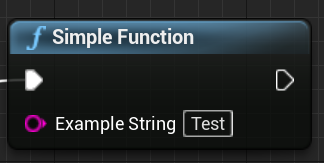
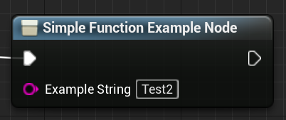
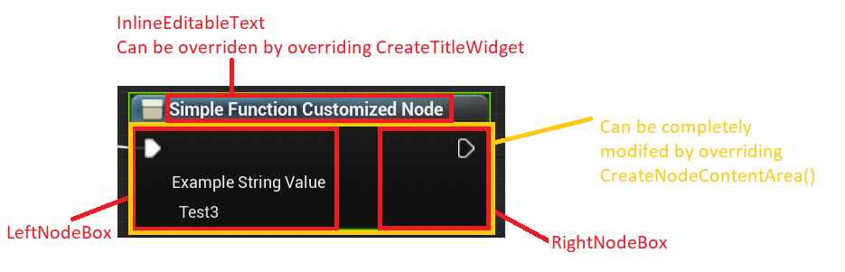
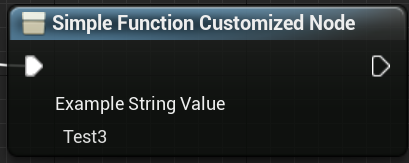

# Example Project for Blueprint Nodes with custom Slate

This project is there to show how one would create blueprint nodes with custom Slate.

But first some basics on creating Blueprint Nodes in C++.

## The simple non-customized node

The easiest way to create a blueprint node in C++ is using the UFUNCTION macro above a function.

An example:
```cpp
UFUNCTION(BlueprintCallable, Category="Customized BP Nodes Example")
static void SimpleFunction(FString ExampleString);
```

This will generate the following:



This method however does not allow a lot of customization for the visual part of node. The only things that can be changed are the input and output parameters of the node. These can however not be changed through for example a change in a property of the node.

## The C++-based non-customized node

### Nodes basics

In the Unreal Engine all nodes, no matter what type of node have a common base class, named EdGraphNode. If one would create a completely new node editor, all nodes in that node editor will derive from this class.

This class sets up all the basic functionality for all nodes, for example allow duplication/deletion, position/size of the node, basic input/output pin support and mangement, and basic stylization of the nodes.

Derived from this class are all other forms of nodes: AnimationState Machine Nodes, BehaviorTree nodes, Sound class nodes, Physics Asset Nodes, ...

In general, when creating a new graph editor in C++, a good starting point is the EdGraph folder in the Engine module.

Also important to note is that every graph editor is using a Graph Schema. If a node is not supported in your dervied Graph Schema, it cannot be used in that graph editor.

### K2Nodes

The one derived class important for us now is the K2Node, which is the base node for blueprint nodes. This node add support for all the specific cases of nodes needed in blueprint: Pure nodes, entry nodes, exit nodes, variable nodes, compact nodes, bead node, ...

It also has support to display them in the node browser opened in the blueprint editor when right-clicking.

### Setup of the C++-based non-customized node
1. First step is to setup a new class deriving from UK2Node.
2. Override the function GetMenuCategory().
    - This function specifies the category in which this node is found in the node browser.
3. Override the function GetMenuActions(...)
    - This function needs to be overriden to ensure that the node is registered with the node browser
    - Below is an example content of the function
    ```cpp
    Super::GetMenuActions(ActionRegistrar);

	UClass* Action = GetClass();

	if (ActionRegistrar.IsOpenForRegistration(Action)) {
		UBlueprintNodeSpawner* Spawner = UBlueprintNodeSpawner::Create(GetClass());
		check(Spawner != nullptr);

		ActionRegistrar.AddBlueprintAction(Action, Spawner);
	} ```
4. Override the function GetNodeTitle(...). Use this to set the title of your node. This is displayed in the node browser and at the top of the node.
5. Override the function GetTooltipText(). Use this to provide the end user some kind of tooltip text to know what the node does.
6. Next step is to setup our pins, that the ndoe should have. For this reason we need to override the function AllocateDefaultPins()
    - In this function you will call the function CreatePin(...) to add all the type of pins that you need for your function
    - Example: ```CreatePin(EGPD_Input, UEdGraphSchema_K2::PC_Exec, {}, nullptr, UEdGraphSchema_K2::PN_Execute);```
        - This will create an input pin that is an execution line pin, and is named after the internal name used for execution pins
    - Example: ``` CreatePin(EGPD_Input, UEdGraphSchema_K2::PC_String, {}, nullptr, TEXT("ExampleString")); ```
        - This will create an input pin that is a string pin, and is named ExampleString
    - **IMPORTANT**: If your node is not a pure blueprint node, meaning it is changing the state of something, then make sure to create the exec (UEdGraphSchema_K2::PN_Execute) and then (UEdGraphSchema_K2::PN_Then) pins. Otherwise you will have troubles later on.
7. Finally, the last function that needs to be overridden is ExpandNode(...). This is where we actually set up the functionality of the node. It can be compared with writing a macro node in the blueprint editor, just on a C++ level. We use this to construct our system, as the alternative option is to write actual node handlers, which generate the acutal instructions to the blueprint processor (see EKismetCompiledStatementType)
    - In this case we are again working with a UFUNCTION to which is used in the background when using this node. For this create a UFUNCTION somewhere in your game code (runtime), that we can use later on.
    ```cpp
    // Function need to be BlueprintInternalUseOnly as otherwise it shows up in the node browser
    UFUNCTION(BlueprintCallable, meta=(BlueprintInternalUseOnly="true"), Category="Customized BP Nodes Example")
	static void SimpleFunctionForNode(FString ExampleString);
    ```
    - Back to the ExpandNode implementation, the next step is that we need to get the internal UFunction object from the class that has this function.
    ```cpp
    // Gets the function name and also ensures that the function actually exists in this class
    const FName FunctionName = GET_FUNCTION_NAME_CHECKED(UExampleFunctionsLibrary, SimpleFunctionForNode);
    // Gets the actual UFunction from the class
	UFunction* SimpleFunctionForNodeFunction = UExampleFunctionsLibrary::StaticClass()->FindFunctionByName(FunctionName);
    ```
    - Next step is to spawn a the internal blueprint node to call a function.
    ```cpp
    UK2Node_CallFunction* SimpleFunctionForNode = CompilerContext.SpawnIntermediateNode<UK2Node_CallFunction>(this, SourceGraph);
    ```
    - This function now needs to be told what function it should use, and then **after** this allocate the default pins. If you call AllocateDefaultPins before actually setting the function, then, this node will not have any pins generated, which we need later on.
    ```cpp
    // This needs to happen before allocating the default pins
    SimpleFunctionForNode->SetFromFunction(SimpleFunctionForNodeFunction);
	SimpleFunctionForNode->AllocateDefaultPins();
	CompilerContext.MessageLog.NotifyIntermediateObjectCreation(SimpleFunctionForNode, this);
    ```
    - Now that everything is ready, comes the most important part. All pin links from the the C++-based non-customized node are now moved to the K2Node_CallFunction node. This is important because the C++-based non-customized node doesn't do anything on its own. As mentioned earlier, it is basically like writing a macro, which is replaced at compile-time with the actualy code. **IMPORTANT**: Make sure you name the pins in your overridden AllocateDefaultPins same as the parameters of your blueprint unternal use only function, so it makes it easier to match them up in this step.
    ```cpp
    // Move the pin links from the input and output pins using the CompilerContext.
	CompilerContext.MovePinLinksToIntermediate(*FindPin(TEXT("ExampleString")), *SimpleFunctionForNode->FindPin(TEXT("ExampleString")));
    //Exec pins
    UEdGraphPin* NodeExec = GetExecPin();
	UEdGraphPin* NodeThen = FindPin(UEdGraphSchema_K2::PN_Then);
	UEdGraphPin* DisplayDialogTextFunctionNodeExecPin = SimpleFunctionForNode->GetExecPin();
    UEdGraphPin* DisplayDialogTextFunctionNodePin = SimpleFunctionForNode->GetThenPin();

	// Move Exec and Then links to internal node
    CompilerContext.MovePinLinksToIntermediate(*NodeExec, *DisplayDialogTextFunctionNodeExecPin);
	CompilerContext.MovePinLinksToIntermediate(*NodeThen, *DisplayDialogTextFunctionNodePin);
	
	//After we are done we break all links to this node (not the internally created one)
	BreakAllNodeLinks();
    ```
8. Congratulations, you now have created your first example node in C++. The result should be the following node:



## The C++-based customized node
This assumes you have followed the guide above for the C++-based non-customized node.

For customizing the actual node, it is important to understand the visual anatomy of a blueprint node.


Every Graph Node has a title area and a content area. If you intend to use pins with your node then you should, when overriding the CreateNodeContentArea() function, call the super function first, to ensure that the graph node still works correct internally. An example would be to add an additional vertical box below the LeftNodeBox and RightNodeBox.

Now, for actually creating your customized node, follow these steps:
1. Duplicate the class from the previous example and rename it to \<previous-name\>Customized.
2. In this customized class remove the CreatePin function call in AllocateDefaultPins for ExampleString.
3. Add a member variable called ExampleString.
4. In the ExpandNode(...) function replace the MovePinLinksToIntermediate function call for the ExampleString pin with the following:
    - ``` SimpleFunctionForNodeCustomized->FindPin(TEXT("ExampleString"))->DefaultValue = ExampleString; ```
    - This sets the value of the ExampleString pin in the CallFunction Node to the Value of the member variable.
5. Create a class that derives from SGraphNodeK2Node. This is the specific widget used for blueprint nodes. If you plan on creating your own Graph Editor with custom nodes, you will need to create a base class that derives from SGraphNode first.
6. Add the following boilerplate to the class:
```cpp 
public:
	SLATE_BEGIN_ARGS(SSimpleFunctionCustomizedWidget)
		{
		}

	SLATE_END_ARGS()

	/** Constructs this widget with InArgs */
	void Construct(const FArguments& InArgs, UK2Node* InNode);
```
7. The construct is different than one would expect, because we need to tell the widget what node this widget is for.
8. In the implementation of the Construct function, set the member variable GraphNode to InNode. Afterwards call the UpdateGraphNode function, to update the visual.
9. As a next step, override the CreatePinWidgets() function. In this function we will now create a text field, where the user can write in the example string.
```cpp
auto* SimpleFunctionCustomizedNode = Cast<USimpleFunctionCustomizedNode>(GraphNode);

	LeftNodeBox->AddSlot()
	.AutoHeight()
	.Padding(FMargin { 32, 4, 4, 4})
	[
		SNew(STextBlock)
			.Text(NSLOCTEXT("CustomizedBPNodes", "Label.ExampleString", "Example String Value"))
			.TextStyle(FEditorStyle::Get(), "Graph.Node.PinName")
			.IsEnabled(this, &SGraphNodeK2Base::IsNodeEditable)
	];

	LeftNodeBox->AddSlot()
	.AutoHeight()
	.Padding(FMargin { 36, 4, 4, 4 })
	[
		SNew(SEditableText)
		.Text(FText::FromString(SimpleFunctionCustomizedNode->ExampleString))
		.HintText(NSLOCTEXT("CustomizedBPNodes", "Label.DialogPlaceholderText", "Enter example string..."))
		.OnTextChanged(this, &SSimpleFunctionCustomizedWidget::OnExampleStringChanged)
		.IsEnabled(this, &SGraphNodeK2Base::IsNodeEditable)
	];
```
10. As already seen above we have to implement a OnExampleStringChanged callback function. This one will be setting the ExampleString member variable in our Blueprint Node.
```cpp
	auto* SimpleFunctionCustomizedNode = Cast<USimpleFunctionCustomizedNode>(GraphNode);
    
    // Need to tell the Blueprint Node that it was modified.
	SimpleFunctionCustomizedNode->Modify();
	SimpleFunctionCustomizedNode->ExampleString = DialogText.ToString();
	FBlueprintEditorUtils::MarkBlueprintAsModified(SimpleFunctionCustomizedNode->GetBlueprint());
```
11. Finally, go back to the duplicated node class, and override the CreateVisualWidget() function. This will tell the node what widget to use. In this case we tell the node to use our newly created widget.
    - ```return SNew(SSimpleFunctionCustomizedWidget, this);```
12. Congratulations, you have now customized your blueprint node! The result should be the following node:

